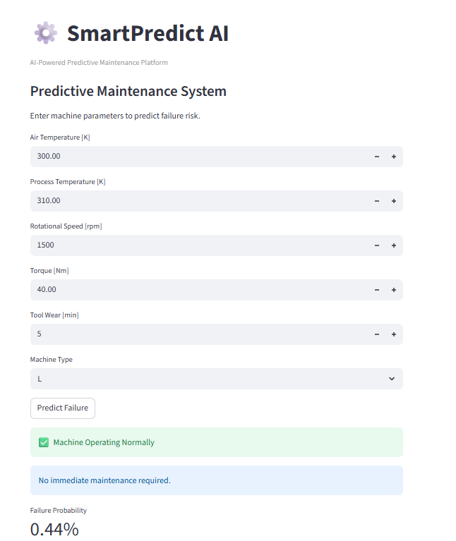
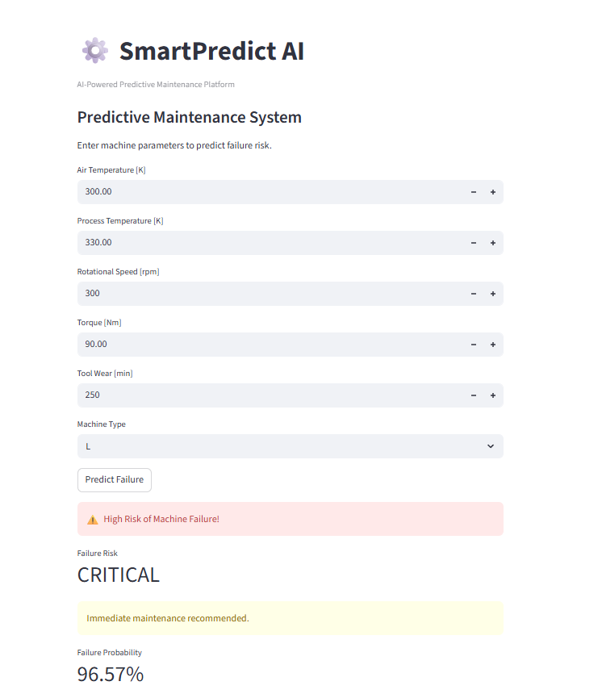

\# SmartPredict AI


SmartPredict AI is a machine learning-based predictive maintenance system designed to detect potential industrial machine failures before they occur.


\## Project Objective


The goal of this project is to predict machine failure using sensor and operational data. The system helps reduce downtime, maintenance costs, and unexpected failures.


\## Dataset


The project uses the AI4I 2020 Predictive Maintenance Dataset.


Main features include:


\- Air temperature

\- Process temperature

\- Rotational speed

\- Torque

\- Tool wear

\- Machine type

\- Machine failure target


\## Machine Learning Problem


This is a binary classification problem:


\- 0 = No Failure

\- 1 = Machine Failure


\## Key Challenge


The dataset is highly imbalanced:


\- Most machines do not fail

\- Failure cases are rare


Because of this, accuracy alone is not enough. Recall and F1-score are more important, especially for detecting failure cases.


\## Feature Engineering


Two important engineered features were created:


\### Temperature Difference


Process temperature minus air temperature.


This helps capture thermal stress on the machine.


\### Power


Rotational speed multiplied by torque.


This helps represent mechanical load.


\## Models Compared


Three models were trained and compared:


1\. Logistic Regression

2\. Random Forest

3\. XGBoost


\## Model Evaluation


The models were evaluated using:


\- Accuracy

\- Precision

\- Recall

\- F1-score

\- Confusion Matrix


Recall was considered especially important because missing a real failure can be costly in industrial environments.


\## Hyperparameter Tuning


GridSearchCV was used to tune the XGBoost model.


The tuning process optimized recall because the main goal is to detect as many failures as possible.


\## Explainability


SHAP was used to explain model predictions and understand which features influenced the model most.


\## Web Application


A Streamlit web application was created to allow users to enter machine parameters and receive:


\- Failure prediction

\- Failure probability

\- Risk level

\- Maintenance recommendation


\## Project Structure


```text

smartpredict/

│

├── app/

│   └── streamlit\_app.py

│

├── data/

│   ├── raw/

│   └── processed/

│

├── models/

│   └── xgboost\_model.pkl

│

├── notebooks/

│   └── 01\_eda.ipynb

│

├── reports/

├── src/

├── README.md

├── requirements.txt

└── main.py


Install dependencies:


pip install -r requirements.txt


Run the Streamlit app:


streamlit run app/streamlit\_app.py

## Application Preview

### Normal Operation



### Failure Prediction



## Conclusion

This project demonstrated how machine learning can be used for predictive maintenance in industrial environments.

By combining feature engineering, model tuning, explainability techniques, and an interactive Streamlit application, the system can help detect machine failures before they occur.

Among all tested models, XGBoost achieved the best performance for failure detection, especially in terms of recall, making it suitable for predictive maintenance applications where missing a failure can be costly and dangerous.

